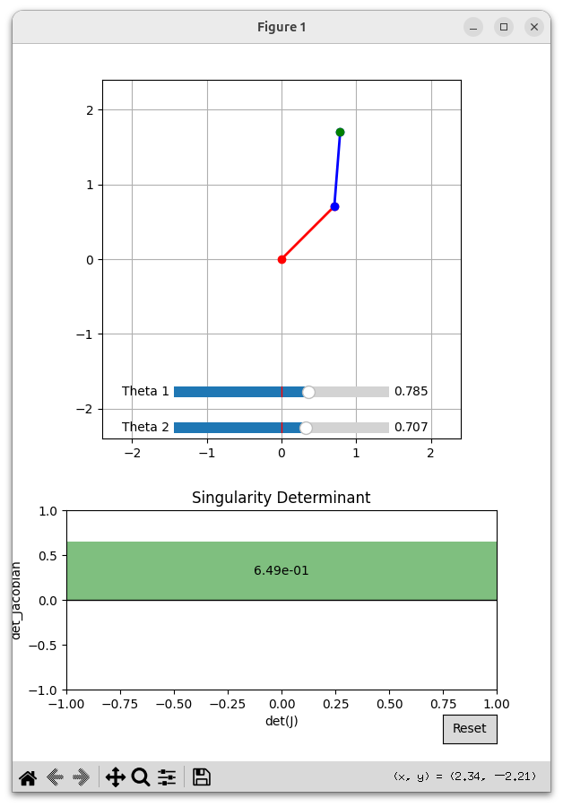

# robot_singularity_detector

설명: 사용자가 실시간으로 로봇 시뮬레이션하며 특이점 발생 가능성 판단할 수 있는 프로그램 개발

사용 기술:  
-프로그래밍 언어: Python
    라이브러리 : Python matplotlib, Slider, numpy
-수학적 모델: 로봇 자코비안(Jacobian) 행렬을 사용한 특이점(singularity) 판단 알고리즘

주요 기능:
-로봇 팔의 자코비안(Jacobian) 행렬을 사용한 특이점(singularity) 판단 알고리즘
-Python matplotlib, Slider라이브러리를 활용한 실시간 시뮬레이션
-행렬식이 0 또는 0에 가까운 경우, 특이점(Singularity)으로 판단 -> 시뮬레이션에 경고 표시

성과 :
-시간 절약 : 행렬식 계산을 자동화해 기존 시간 대비 40% 효율 향상
-비용 절감 : 시뮬레이션을 통해 로봇의 특이점 발생 동작을 미리 알고 대처 가능
-운동성 향상: 특이점을 회피하기 위한 로봇 경로 계획 및 제어 전략 개발.

